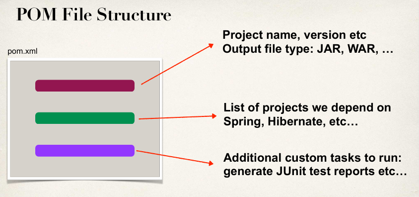

# Spring Boot 4: Learn Spring 7, Spring Core, Spring REST, Spring Security, JPA, Hibernate, Swagger, Spring MVC, MySQL
#### Instructor: Chad Darby

- https://github.com/darbyluv2code/spring-boot-4-spring-7-hibernate-for-beginners
- https://www.luv2code.com/downloads/udemy-spring-boot-4/spring-boot-4-pdfs.zip

### Spring Initializr:
- https://start.spring.io/

### Maven:
- Dependency Management
  - Find JAR files for you
  - No more missing JARs
- Building and Running your project
  - No more build path / classpath issues
- Standard directory structure

### POM(Project Object Model) file:
- Dependency configuration file for your project
- Located in the root of you Maven project
- Dependency coordinates can be found here https://central.sonatype.com

### SpringBoot DevTools:
- Useful for code development, enables auto server restart on any code change.
- Dependency needs to be added into pom file.

### SpringBoot Actuator:
- Exposes endpoints to monitor and manage your application.
- Dependency needs to be added into pom file.

### SpringBoot Properties category:
- Core:
  - Log levels
  - Log file name
- Web:
  - Http Server port
  - Context-path
  - Http session timeout
- Security:
  - Default user name and password
- Data:
  - Database related properties
- Actuator:
  - Endpoints to include and exclude
  - Actuator endpoint base-path
- Integration:
- Testing:
- Devtools: