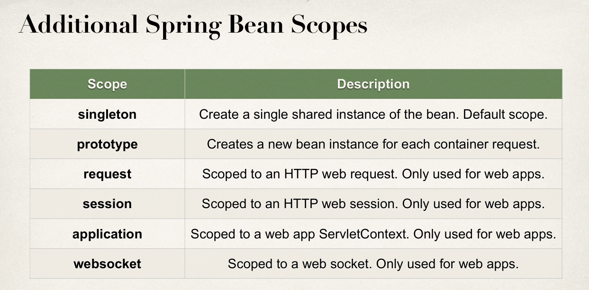
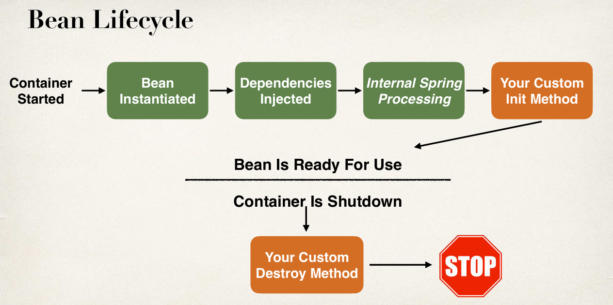

### Spring Container:
- Spring Container is like an Object Factory with two primary functions:
  - Create and manage objects - `Inversion of Control`
  - Inject dependencies to the object - `Dependency Injection`

### Configuring Spring Container:
- XML configuration file - legacy
- Java Annotations - modern
- Java Source Code - modern

### Two recommended types of Injection:
- Constructor Injection
- Setter Injection
- Field Injection (not recommended) Accomplished by Java Reflection.

### Spring AutoWiring:
- Autowiring is used for injecting dependencies.
- Spring will look for type(class or interface) that matches and injects it automatically.

### @Component - Class level:
- Marks the class as Spring Bean making the class available for Dependency Injection.

### @Autowired - Constructor/method level:
- Tells the Spring to inject the dependency.

### @SpringBootApplication - Class level:
Bootstrap the application - creates application context, registers all beans and starts the embedded Tomcat server, etc...
- `@EnableAutoConfiguration` Enables SpringBoot's auto-configuration support.
- `@ComponentScan` Enables component scanning of current package. Also, recursively scans sub-packages.
- `@Configuration` Able to register extra beans with `@Bean` or import other configuration classes.

### @Qualifier - Parameter level:
- Tells the Spring which bean to inject, in case of multiple eligible beans.
- `@Qualifier` has higher priority than `@Primary`

### @Primary - Class level:
- Tells the Spring which bean to inject, in case of multiple eligible beans.
- At the most, one class can be marked as Primary.

### @Lazy - Class level:
- Tells the Spring to create bean for this class only when needed for dependency injection or explicitly requested.

### Bean Scopes(Singleton by default):
Refers to the lifecycle of a bean
- How long does the bean live?
- How may instances are created?
- How is the bean shared?

### Bean lifecycle:

### @PostConstruct - Method level:
- Used to call custom code during bean initialization.

### @PreDestroy - Method level:
- Used to call custom code during bean destruction.
