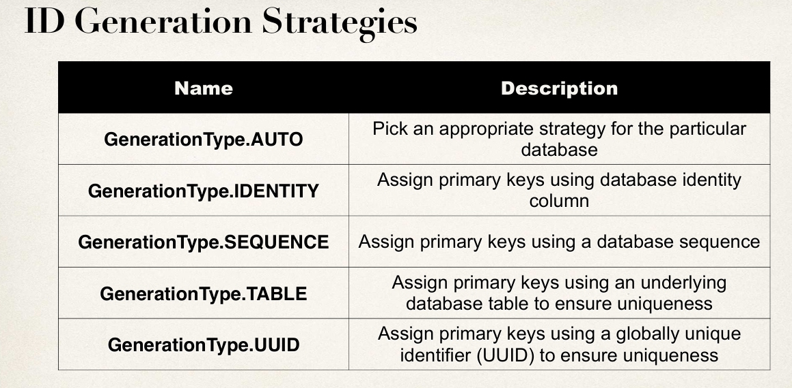
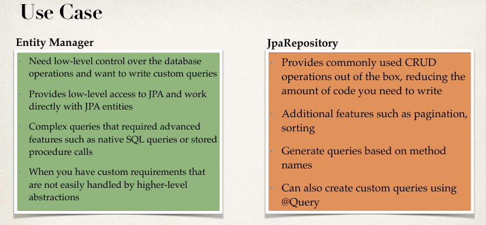
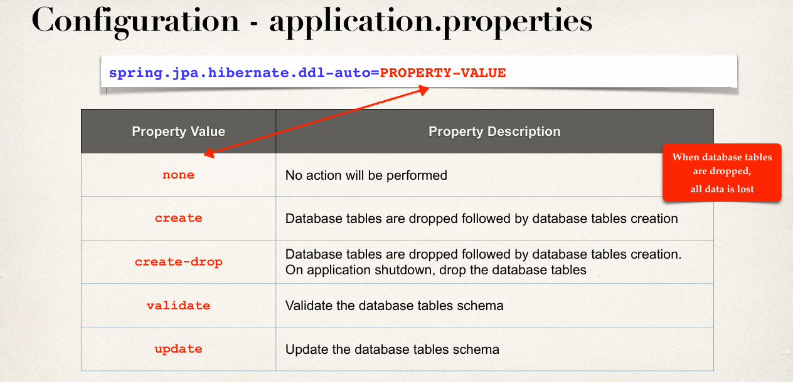

Database: MySQL, Connection: springstudent, Username: springstudent, Password: springstudent

###### Hibernate, JPA and EntityManager is same as learnt in JavaMasterclass course. Here, the EntityManager and Transaction creation and usage has been simplified.

### @Transactional - Method level:
- Automagically begin and end a transaction for your JPA code.

### @Repository - Class level:
- Specialized Annotation for DAOs
- Spring will automatically register the DAO implementation
- Spring also provides translation of any JDBC related exceptions

